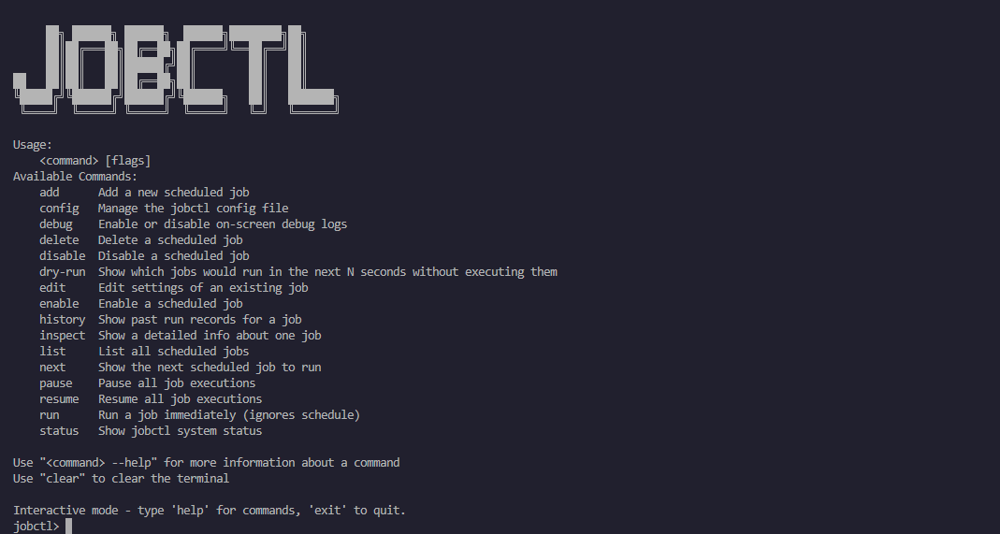

# jobctl

**A lightweight job scheduler and runner in your terminal via a simple CLI.**
Define your recurring shell tasks, either by using the `add` command or editing the TOML configuration file, and manage them interactively.

# Project Screenshot


# Project Structure
```bash
┌── internal
│   ├── cli             # Argument parsing and command dispatch
│   ├── cmd             # Subcommand implementations (add, edit, list, etc.)
│   ├── config          # Load / save configuration (jobs.toml)
│   ├── db              # SQLite access layer and schema migrations
│   ├── initapp         # Application bootstrapping (DB, logger, etc.)
│   ├── logger          # Logging setup and configuration
│   ├── logic           # Core job control logic
│   ├── runner          # Scheduled job runner and ticker
│   ├── shell           # Interactive shell interface
│   ├── types           # Custom types and shared interfaces
│   ├── util            # Path resolution, flag parsing, formatting helpers
│   └── watcher         # Live reload for config changes
├── migrations          # SQL migration files for database schema
├── go.mod
├── go.sum
├── main.go             # Application entry point
└── README.md
```

# Requirements
### For General Use (Prebuilt Releases)
- No installation needed beyond unpacking.
- Compatiable with:
    - **macOS (Intel, Apple Silicon)**
    - **Linux (x86_64, ARM64)**
    - **Windows 10+ (x64, 32-bit)**

### For Development / Building From Source
- Go 1.20+
- Git

# Installation & Usage
### Quick Start (Using Prebuilt Binaries)
1. Download the latest release for your OS from:
https://github.com/Ege-Okyay/jobctl/releases

2. Unpack and install:

    **Windows**
    - Download `jobctl.exe` from the latest release.
    - Run it directly from the download folder, or move it somewhere in your system `PATH` (e.g. `c:\Tools\`).
    - Optional (to add to `PATH`)
        ```powershell
        setx PATH "$($Env:PATH);C:\Path\To\jobctl"
        ```

    **macOS / Linux**
    - Download the appropriate `jobctl` binary (no extensions).
    - Make it executable and move it to your `PATH`:
        ```bash
        chmod +x jobctl
        sudo mv jobctl /usr/local/bin/
        ```

3. First-time setup:
    ```bash
    jobctl
    ```

4. Edit your jobs file:
    - **macOS / Linux:** `~/.config/jobctl/jobs.toml`
    - **Windows:** `%APPDATA%\jobctl\jobs.toml`

    Then start the shell:
    ```bash
    jobctl
    ```

# Configuration
On first run, `jobctl` creates a `jobs.toml` in your config directory:

- **macOS/Linux:** `~/.config/jobctl/jobs.toml`
- **Windows:** `%APPDATA%\jobctl\jobs.toml`

Here's how `jobs.toml` looks like:

```toml
# jobctl config

# Add your [[job]] entries below

[[job]]
  name = "backup"
  interval = 3600
  command = "/usr/local/bin/backup.sh"
  retries = 0
  timeout = 0
  enabled = true
```

- `[[job]]` : Defines one task
- `name`    : Unique identifier
- `interval`: Run every N seconds
- `command` : Command string that the job will execute
- `retries` : Number of automatic re-attempts on failure (optional)
- `timeout` : Maximum execution time in seconds (optional)
- `enabled` : Toggle each job on or off

Once you've edited and saved this file, `jobctl` will pickup changes automatically

Override `jobs.toml` file:
```bash
jobctl config set /path/to/custom/custom-jobs.toml
```

# CLI Usage
```bash
# Add a new job:
jobctl add --name backup --interval 3600 --command "/usr/local/bin/backup.sh" [--retries <n>] [--timeout <seconds>]

# Manage the config file:
jobctl config show
jobctl config set <path>
jobctl config validate
jobctl config edit
jobctl config reset

# Delete a job:
jobctl delete backup

# Enable or disable on-screen debug logs:
jobctl debug on
jobctl debug off

# List all jobs:
jobctl list

# Edit an existing job:
jobctl edit backup --interval 7200

# Pause/resume the scheduler:
jobctl pause
jobctl resume

# Dry-run upcoming jobs in next 60s (or customize window):
jobctl dry-run
jobctl dry-run --seconds 10

# Enable or disable a job:
jobctl disable backup
jobctl enable backup

# Run a job immediately with or without affecting its schedule:
jobctl run backup
jobctl run backup --keep-remaining

# Show the next scheduled job:
jobctl next

# View run history (last N runs):
jobctl history backup --limit 5

# Inspect details of the last run:
jobctl inspect backup

# Show system status:
jobctl status
```

# Contributing
Open an issue or submit a pull request if you have any ideas for improvements or find any bugs.

- **Fork the repository**
- **Create a new branch:** `git checkout -b feature-branch`
- **Commit your changes:** `git commit -m "Add feature"`
- **Push to the branch:** `git push origin feature-branch`
- **Open a pull request**

# License
This project is licensed under the [MIT License](LICENSE).